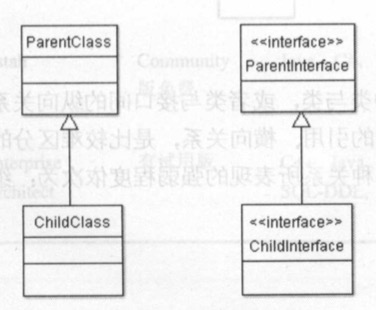
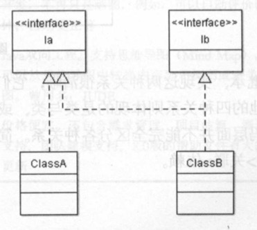
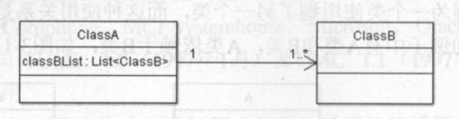
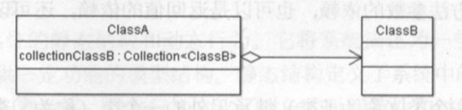
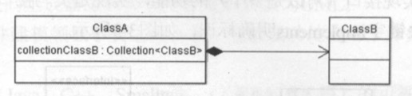
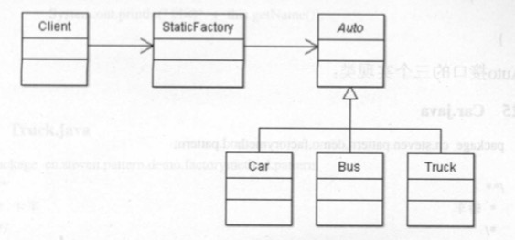
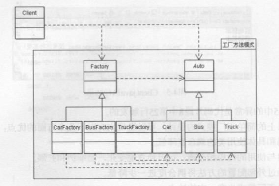
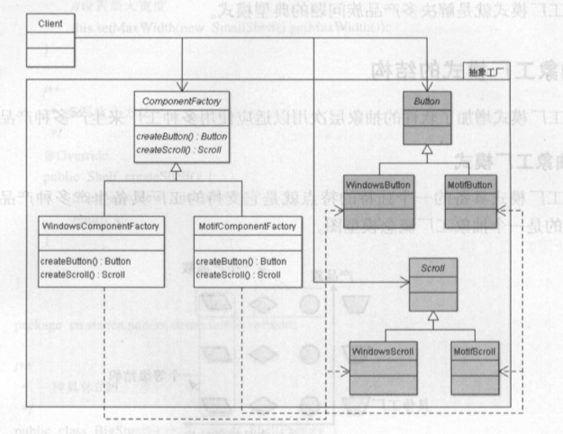

# UML(Unified Modeling Language)

### UML中的关系
- 依赖关系

	一个类使用到另一个类，这种使用关系是偶然的、临时的、非常弱的。

	依赖关系可以是方法参数的依赖，返回值的依赖，还可以是代码中的直接依赖。

	


- 继承关系

	类与类或接口与接口之间的关系，体现了一种is-a的关系

	

- 实现关系

	类与接口之间的关系

	

- 关联关系

	体现的是两个类或类与接口之间语义级别的强依赖关系，比如班级与学生。这种关系比依赖更强。

	

- 聚合关系

	是关联关系的一种特例，体现的语义是整体与部分的拥有关系，即has-a的关系，此时整体与部分之间是可分离的，它们可以具有各自的生命周期，属于多个整体对象，也可以为多个整体对象共享。

	

- 组合关系

	是关联关系的一种特例，体现的语义是一种包含关系，即contains-a。这种关系比聚合更强，也称强聚合。同样体现整体与部分间的关系，此时整体与部分是不可分的，整体的生命周期结束也意味着部分的生命周期结束。

	


# 设计模式


### Singleton

```
# 第一种方式，直接创建实例对象

public class Singleton {

    private Singleton() {}

    private static Singleton uniqueInstance = new Singleton();

    public static Singleton getInstance() {
        return uniqueInstance;
    }
}
```
```
# 第二种方式，延迟创建实例对象。此方法在多线程环境下会出现创建多个实例对象的问题。

public class Singleton {

    private Singleton() {}

    private static Singleton uniqueInstance;

    public static Singleton getInstance() {
        if(uniqueInstance == null)
            uniqueInstance = new Singleton();
        return uniqueInstance;
    }
}
```
```
# 第三种方式，使用锁机制来保证在多线程环境下只创建一个实例。使用synchronized会降低程序性能

public class Singleton {

    private Singleton() {}

    private static Singleton uniqueInstance;

    public synchronized static Singleton getInstance() {
        if(uniqueInstance == null)
            uniqueInstance = new Singleton();
        return uniqueInstance;
    }
}
```
```
# 第四种方式，使用双重检查加锁，只在第一次创建时进行同步以提高程序性能

public class Singleton {

    private Singleton() {}

    private volatile static Singleton uniqueInstance;

    public static Singleton getInstance() {
        if(uniqueInstance == null) {
            synchronized(Singleton.class) {
                if(uniqueInstance == null)
                    uniqueInstance = new Singleton();
            }
        }
        return uniqueInstance;
            
    }
}
```
```
# 第五种方式，使用静态内部类的方式

public class Singleton {

    private Singleton() {}
	
	private static class SingletonHolder{
		
		private static final Singleton INSTANCE = new Singleton();
	}
	
	public static Singleton getInstance() {
		return SingletonHolder.INSTANCE;
	}
}
```
```
# 第六种方式，使用枚举
public enum Singleton {
    
    INSTANCE
}
```
- - -
### Strategy

自定义的类可以通过实现Comparable接口的comparaTo()，来自定义比较规则，但是只能实现一种比较规则，如果要改变比较规则需要修改原来的代码，违反了开闭原则。

例如学生类，有age和score属性，如果开始想通过年龄比较，后期又想通过score比较，就要实现Comparator接口来定义自己的比较器，在排序时传递比较器来进行比较。
```
public class Student{

	String name;
	int age;
	int score;
	
	public Student() {}
	public Student(String name, int age, int score) {
		this.name = name;
		this.age = age;
		this.score = score;
	}
	
	@Override
	public String toString() {
		return "[name: " + name + ", age:" + age + " ,score:" + score + "]";
	}
}
```
```
//自定义的比较器类，通过学生的分数进行比较
public class StudentScoreComparator implements Comparator<Student>{

	@Override
	public int compare(Student o1, Student o2) {
		if(o1.score < o2.score) return -1;
		else if(o1.score > o2.score) return 1;
		return 0;
	}
	
}
```
```
//自定义的排序类，接收一个范型数组和一个比较器
public class Sort {

	//排序的方法
	public static <T> void sorted(T[] arr, Comparator<T> comparator) {
		for(int i = 0; i < arr.length - 1; i++) {
			for(int j = 0; j < arr.length - i - 1; j++) {
				if(comparator.compare(arr[j], arr[j+1]) == -1) {
					T temp = arr[j];
					arr[j] = arr[j+1];
					arr[j+1] = temp;
				}
			}
		}
		System.out.println(Arrays.toString(arr));
	}	
}
```
```
public class Main {

	public static void main(String[] args) {
		
		Student s1 = new Student("Bob",20,85);
		Student s2 = new Student("Lucy",19,90);
		Student s3 = new Student("Lilei",18,99);
		Student s4 = new Student("Lily", 18, 59);
		Student[] students = {s1,s2,s3,s4};
		Sort.sorted(students, new StudentScoreComparator());
	}
}
```
- - -
### Factory

#### SimpleFactory / StaticFactory

调用工厂类中的静态方法，通过传递参数来决定所创建的对象类型。




#### FactoryMethod

对工厂类也进行了抽象，使用特定类型的工厂类来创建特定类型的对象。

针对每一种类型的对象，都会有一个专门的工厂类



#### AbstractFactory

抽象工厂是工厂方法的扩展。可以通过抽象工厂来创建产品族。

例如各个操作系统下GUI中的按钮和单选框等组件，功能相同，外观不同，这种情况可以使用抽象工厂来实现

	抽象工厂（Component Factory）：工厂的抽象类

	具体工厂（Concrete Factory）：工厂具体实现类，例如WindowsComponentFactory和MotifComponentFactory

	抽象产品（Abstract Product）：Button、Radio

	具体产品（Concrete Product）：WindowsButton、WindowsRadio、MotifButton、MotifRadio



#### BuilderFactory

主要用于分步骤构建一个复杂对象，分步骤是一个稳定的算法，复杂对象的各个部分经常变化

	抽象建造者角色（Builder）：给出一个抽象接口，表示对象的各个组成成分的建造。

	具体建造者角色（Concrete Builder）：创建并提供产品实例

	指导者角色（Director）：指导特定的具体建造者对象进行创建的过程

	产品角色：建造过程中的复杂对象。

- - -
### Facade

- - -
### Mediator

- - -
### Chain of Responsibility

责任链模式，典型实现是Filter
