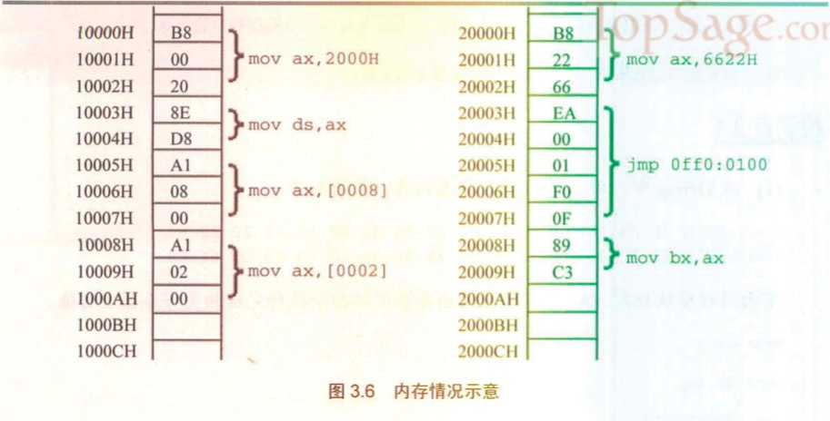

# 《汇编语言》—— 第二版

### 一、基本知识

内存划分成多个存储单元进行存储，一条街相当于内存，街上每个店面的门牌号相当于存储单元。存储单元从0开始编号，一个存储单元可以存储一个Byte，即8个二进制位。

总线就是一根根导线的集合，从逻辑上分为3类

1. 地址总线

    一根导线可以传送的稳定状态只有两种，高电平或低电平，用二进制表示就是1或0，就是一个二进制位。

    一个CPU有N根地址线，CPU的地址总线宽度为N，CPU最多可以寻找2的N次方个内存单元。

2. 控制总线

    控制总线是一些不同控制线的集合。控制总线的宽度决定了CPU对外部器件的控制能力。

    “读信号输出”的控制线负责由CPU向外传送读信号；“写信号输出”的控制线负责传送写信号。

3. 数据总线

    数据总线的宽度决定了CPU和外界的数据传送速度。8根数据总线一次可传送一个8位二进制数据（即一个字节）。

通过机器码驱动CPU进行工作，CPU根据机器码的指令通过总线与其他器件（芯片）进行交互，地址线用于寻找存储单元的地址，控制线发送内存读写命令（选中存储器芯片，通知它将要读写数据），数据线传送存储单元中的数据。

内存地址空间：
    
    由多个物理存储器件所组成的逻辑存储器就是内存地址空间。

    每个物理设备在逻辑存储器中都占有一个地址段，即一段地址空间。CPU在这段地址空间中读写数据，实际上就是在相对应的物理存储器中读写数据。

- - -

检测点1.1

1. 1个CPU的寻址能力为8KB，那么它的地址总线的宽度为【13】。

    8KB = 8192B，一个存储单元是1B，就是8192个存储单元。2的13次方等于8192。

2. 1KB的存储器有【1024】个存储单元。存储单元的编号从【0】到【1023】。
3. 1KB的存储器可以存储【8192】个bit，【1024】个Byte。
4. 1GB、1MB、1KB分别是【1073741824】Byte、【1048576】Byte、【1024】Byte。
5. 8080、8088、80286、80386 的地址总线宽度分别为16根、20根、24根、32根，则它们的寻址能力分别为：【64】(KB)、【1】(MB)、【16】(MB)、【4】(GB)。
6. 8080、8088、8086、80286、80386 的数据总线宽度分别为8根、8根、16根、16根、32根。则它们一次可以传送的数据为：【1】(B)、【1】(B)、【2】(B)、【2】(B)、【4】(B)。
7. 从内存中读取1024字节的数据，8086至少要读【512】次，80386至少要读【256】次。
    
    8086 有 16 根数据总线，一次读2个字节；

    80383 有 32 根数据总线，一次读4个字节。

8. 在存储器中，数据和程序以【二进制】形式存放。

- - -

### 二、寄存器

典型的CPU由运算器、控制器、寄存器等器件构成，这些器件靠内部总线相连。

- 运算器进行信息处理
- 寄存器进行信息存储
- 控制器控制各种器件进行工作
- 内部总线连接各种器件，进行数据传送

物理地址：存储单元在内存地址空间中的唯一地址。CPU向地址总线发送的必须是物理地址，所以必须要在CPU内部先形成这个物理地址，每种CPU形成的方式都不同。

CPU的位数：例如8086CPU，16位结构（16位机、字长为16位）

1. 运算器一次最多处理16位数据；
2. 寄存器的最大宽度为16位；
3. 寄存器和运算器之间的通路为16位

8086CPU寻址方式：基础地址或起始地址（段地址 * 16） + 偏移地址 = 物理地址

    这种方式用两个16位地址合成一个20位的物理地址，达到1MB的寻址能力。

    段地址由CPU划分，内存并没有分段。

段寄存器：提供内存单元的段地址

    段寄存器和IP寄存器（指令指针寄存器）配合工作，可以得到要执行指令的物理地址（IP就相当于偏移地址），读取指令，IP中的值自动增加（读取的数据或指令占几个字节就加几），以使CPU可以读取下一条指令，然后执行指令。

检测点2.1

1. 写出每条汇编指令执行后相关寄存器中的值。

        mov ax,62627        AX=【F4A3H】
        mov ah,31H          AX=【31A3H】
        mov al,23H          AX=【3123H】
        add ax,ax           AX=【6246H】
        mov bx,826CH        BX=【826CH】
        mov cx,ax           CX=【6246H】
        mov ax,bx           AX=【826CH】
        add ax,bx           AX=【04D8H】
        mov al,bh           AX=【0482H】
        mov ah,bl           AX=【6C82H】
        add ah,ah           AX=【D882H】
        add al,6            AX=【D888H】
        add al,al           AX=【D810H】
        mov ax,cx           AX=【6246H】

2. 只能使用目前学过的汇编指令，最多使用4条指令，编程计算2的4次方。

        mov ax,2H       AX=2H
        add ax,ax       AX=4H
        add ax,ax       AX=8H
        add ax,ax       AX=10H

检测点2.2

1. 给定段地址为0001H，仅通过变化偏移地址寻址，CPU的寻址范围为【0010H】到【1000FH】。

        基础地址（起始地址）0001H × 16 = 0010H，寻址范围为：
        (0010H + 0000H) ~ (0010H + FFFFH)

2. 有一数据存放在内存20000H单元中，现给定段地址为SA，若想用偏移地址寻到此单元。则SA应满足的条件是：最小为【1000H】，最大为【2000H】。

        SA × 16 + offset = 20000H;
        SA = (20000H - offset) / 16; 此时运算结果不正确，可能是20000H与offset位数不一致所致
        SA = 2000H - offset / 16; 此时结果正确
        当offset=0000H时，SA的值最大；
        当offset=FFFFH时，SA的值最小。

检测点2.3

下面的3条指令执行后，CPU几次修改IP？都是在什么时候？最后IP中的值是多少？

    mov ax,bx
    sub ax,ax
    jmp ax

    四次修改IP。

    第一次 读取 mov ax,bx
    第二次 读取 sub ax,ax
    第三次 读取 jmp ax
    第四次 执行 jmp ax

    IP中的值是 IP = ax = 0000H

        “jmp 段地址:偏移地址” 指令是用段地址修改CS，偏移地址修改IP
        “jmp 寄存器” 表示用寄存器中的值修改IP

- - -

### 三、寄存器（内存访问）

内存中字的存储

    CPU中，用16位寄存器来存储一个字。高8位存放高位字节，低8位存放地位字节。在内存中存储时，由于内存单元是字节单元（一个单元存放一个字节），所以需要两个连续的内存单元来存放一个字，第八位存储在低地址单元中，高八位存储在高地址单元中。

段地址寄存器

    DS段地址寄存器，保存的是内存单元的段地址，与[]一起配合使用（偏移地址），得到内存单元的物理地址。

栈寄存器

    SS(段地址):SP(偏移地址) 指向栈顶位置

    不能直接向SS寄存器里面写入数据，需要用其他寄存器中转

检测点3.1

1. 在debug中，用“d 0:0 1f”查看内存，结果如下。

        0000:0000 70 80 F0 30 EF 60 30 E2-00 80 80 12 66 20 22 60
        0000:0010 62 26 E6 D6 CC 2E 3C 3B-AB BA 00 00 26 06 66 88

    下面的程序执行前，AX=0，BX=0，写出每条汇编指令执行完后相关寄存器中的值。

        mov ax,1
        mov ds,ax
        mov ax,[0000]   AX = 【2662】
        mov bx,[0001]   BX = 【e626】
        mov ax,bx       AX = 【e626】
        mov ax,[0000]   AX = 【2662】
        mov bx,[0002]   BX = 【d6e6】
        add ax,bx       AX = 【fd48】
        add ax,[0004]   AX = 【2c14】
        mov ax,0        AX = 【0】
        mov al,[0002]   AX = 【00e6】
        mov bx,0        BX = 【0】
        mov bl,[000C]   BX = 【0026】
        add al,bl       AX = 【000c】

2. 内存中的情况如图3.6所示。

    各寄存器的初始值：CS=2000H，IP=0，DS=1000H，AX=0，BX=0；

    1. 写出CPU执行的指令序列（用汇编指令写出）。
    2. 写出CPU执行每条指令后，CS、IP和相关寄存器中的数值。
    3. 再次体会：数据和程序有区别吗？如何确定内存中的信息哪些是数据，哪些是程序？

    

        mov ax,6622H    CS=2000H    IP=3    AX=6622h
        jmp 0ff0:0100   CS=2000H    IP=8    CS=0ff0     IP=0100
        mov ax,2000H    CS=0ff0H    IP=0103 ax=2000h
        mov ds,ax       cs=0ff0h    ip=0105 ds=2000h
        mov ax,[0008]   cs=0ff0h    ip=0108 ax=c389h
        mov ax,[0002]   cs=0ff0h    ip=0111 ax=ea66h

检测点3.2

1. 补全下面的程序，使其可以将10000H~1000FH中的8个字，逆序复制到20000H~2000FH中。如图3.17所示（图中内存里的数据均为假设）。

    

