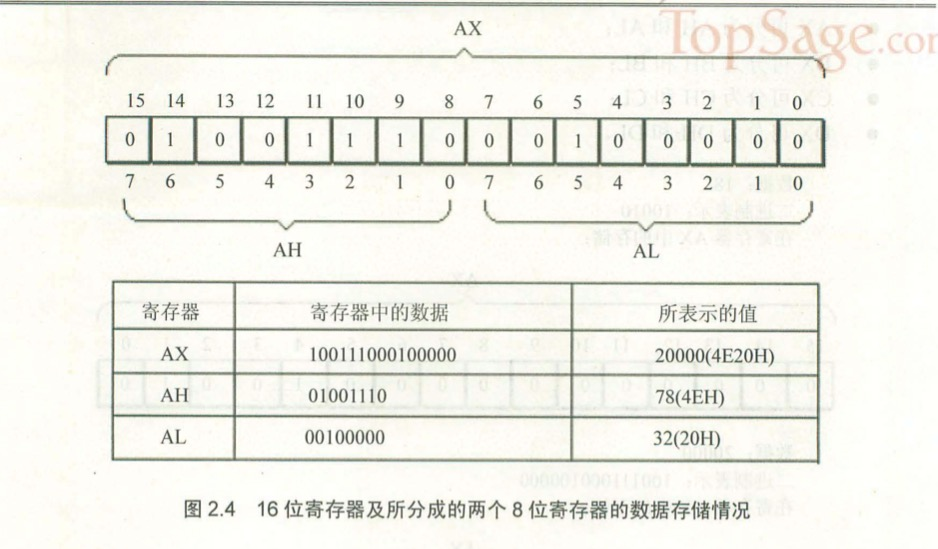

# 《汇编语言》—— 第二版

### 一、基本知识

内存划分成多个存储单元进行存储，一条街相当于内存，街上每个店面的门牌号相当于存储单元。存储单元从0开始编号，一个存储单元可以存储一个Byte，即8个二进制位。

总线就是一根根导线的集合，从逻辑上分为3类

1. 地址总线

    一根导线可以传送的稳定状态只有两种，高电平或低电平，用二进制表示就是1或0，就是一个二进制位。

    一个CPU有N根地址线，CPU的地址总线宽度为N，CPU最多可以寻找2的N次方个内存单元。

2. 控制总线

    控制总线是一些不同控制线的集合。控制总线的宽度决定了CPU对外部器件的控制能力。

    “读信号输出”的控制线负责由CPU向外传送读信号；“写信号输出”的控制线负责传送写信号。


3. 数据总线

    数据总线的宽度决定了CPU和外界的数据传送速度。8根数据总线一次可传送一个8位二进制数据（即一个字节）。

通过机器码驱动CPU进行工作，CPU根据机器码的指令通过总线与其他器件（芯片）进行交互，地址线用于寻找存储单元的地址，控制线发送内存读写命令（选中存储器芯片，通知它将要读写数据），数据线传送存储单元中的数据。


内存地址空间：
    
    由多个物理存储器件所组成的逻辑存储器就是内存地址空间。

    每个物理设备在逻辑存储器中都占有一个地址段，即一段地址空间。CPU在这段地址空间中读写数据，实际上就是在相对应的物理存储器中读写数据。


- - -

检测点1.1

1. 1个CPU的寻址能力为8KB，那么它的地址总线的宽度为【13】。

    8KB = 8192B，一个存储单元是1B，就是8192个存储单元。2的13次方等于8192。

2. 1KB的存储器有【1024】个存储单元。存储单元的编号从【0】到【1023】。
3. 1KB的存储器可以存储【8192】个bit，【1024】个Byte。
4. 1GB、1MB、1KB分别是【1073741824】Byte、【1048576】Byte、【1024】Byte。
5. 8080、8088、80286、80386 的地址总线宽度分别为16根、20根、24根、32根，则它们的寻址能力分别为：【64】(KB)、【1】(MB)、【16】(MB)、【4】(GB)。
6. 8080、8088、8086、80286、80386 的数据总线宽度分别为8根、8根、16根、16根、32根。则它们一次可以传送的数据为：【1】(B)、【1】(B)、【2】(B)、【2】(B)、【4】(B)。
7. 从内存中读取1024字节的数据，8086至少要读【512】次，80386至少要读【256】次。
    
    8086 有 16 根数据总线，一次读2个字节；

    80383 有 32 根数据总线，一次读4个字节。

8. 在存储器中，数据和程序以【二进制】形式存放。

- - -

### 二、寄存器

8086CPU 共有 14 个寄存器

- AX、BX、CX、DX 为通用寄存器

    1. 每个寄存器大小为 16 位，即 2 个字节
    2. 每个寄存器可以分成两个可独立使用的 8 位寄存器
    3. AX 分为 AL 和 AH，AL 进行运算如果进位不会保存在 AH 中

    

8086CPU 可以一次性处理一下两种尺寸的数据

- 字节：byte，由8个bit组成，可以存在8位寄存器中
- 字：word，由两个字节组成，这两个字节分别称为这个字的高位字节和地位字节

#### 注意：在进行数据传送或运算时，指令的两个操作对象的位数应当是一致的

正确的指令：

    mov ax,bx
    mov bx,cx
    mov ax,18H
    mov al,18H
    add ax,bx
    add ax,20000

错误的指令：

    mov ax,bl   (在8位寄存器和16位寄存器之间传送数据)
    mov bh,ax   (在16位寄存器和8位寄存器之间传送数据)
    mov al,20000    (8位寄存器最大可存放值为255的数据)
    add al,100H     (将一个高于8位的数据加到一个8位寄存器中)


典型的CPU由运算器、控制器、寄存器等器件构成，这些器件靠内部总线相连。

- 运算器进行信息处理
- 寄存器进行信息存储
- 控制器控制各种器件进行工作
- 内部总线连接各种器件，进行数据传送

物理地址：存储单元在内存地址空间中的唯一地址。CPU向地址总线发送的必须是物理地址，所以必须要在CPU内部先形成这个物理地址，每种CPU形成的方式都不同。

CPU的位数：例如8086CPU，16位结构（16位机、字长为16位）

1. 运算器一次最多处理16位数据；
2. 寄存器的最大宽度为16位；
3. 寄存器和运算器之间的通路为16位


当8086CPU读写内存时：

1. CPU中的相关部件提供两个16位的地址，一个称为段地址，另一个称为偏移地址
2. 段地址和偏移地址通过内部总线送入一个称为地址加法器的部件；
3. 地址加法器将两个16位地址合成为一个20位的物理地址，达到1MB的寻址能力；
4. 地址加法器通过内部总线将20位物理地址送入输入输出控制电路；
5. 输入输出控制电路将20位物理地址送上地址总线
6. 20位物理地址被地址总线传送到存储器

地址加法器采用 

    物理地址 = 段地址 × 16 + 偏移地址
    段地址 × 16：相当于段地址二进制表示左移4位（十六进制左移1位）

    一个数据的二进制形式左移1位，相当于×2
    一个数据的十进制形式左移1位，相当于×10
    一个数据的十六进制形式左移1位，相当于×16

8086CPU的寻址功能是：

    基础地址 + 偏移地址 = 物理地址
    段地址 × 16 只是基础地址的一种具体实现


将若干地址连续的内存单元看作一个段，段的长度受偏移地址的影响，偏移地址为16位，寻址能力为64KB，所以一个段的最大长度为64KB。段地址由CPU划分，内存并没有分段。

CPU可以用不同的段地址和偏移地址形成同一个物理地址

    段地址    偏移地址    物理地址
    2000H    1F60H      21F60H
    2100H    0F60H      
    21F0H    0060H
    21F6H    0000H
    1F00H    2F60H

段寄存器：提供内存单元的段地址

    段寄存器和IP寄存器（指令指针寄存器）配合工作，可以得到要执行指令的物理地址（IP就相当于偏移地址），读取指令，IP中的值自动增加（读取的数据或指令占几个字节就加几），以使CPU可以读取下一条指令，然后执行指令。


检测点2.1

1. 写出每条汇编指令执行后相关寄存器中的值。

        mov ax,62627        AX=【F4A3H】
        mov ah,31H          AX=【31A3H】
        mov al,23H          AX=【3123H】
        add ax,ax           AX=【6246H】
        mov bx,826CH        BX=【826CH】
        mov cx,ax           CX=【6246H】
        mov ax,bx           AX=【826CH】
        add ax,bx           AX=【04D8H】
        mov al,bh           AX=【0482H】
        mov ah,bl           AX=【6C82H】
        add ah,ah           AX=【D882H】
        add al,6            AX=【D888H】
        add al,al           AX=【D810H】
        mov ax,cx           AX=【6246H】

2. 只能使用目前学过的汇编指令，最多使用4条指令，编程计算2的4次方。

        mov ax,2H       AX=2H
        add ax,ax       AX=4H
        add ax,ax       AX=8H
        add ax,ax       AX=10H


检测点2.2

1. 给定段地址为0001H，仅通过变化偏移地址寻址，CPU的寻址范围为【0010H】到【1000FH】。

        基础地址（起始地址）0001H × 16 = 0010H，寻址范围为：
        (0010H + 0000H) ~ (0010H + FFFFH)

2. 有一数据存放在内存20000H单元中，现给定段地址为SA，若想用偏移地址寻到此单元。则SA应满足的条件是：最小为【1000H】，最大为【2000H】。

        SA × 16 + offset = 20000H;
        SA = (20000H - offset) / 16; 此时运算结果不正确，可能是20000H与offset位数不一致所致
        SA = 2000H - offset / 16; 此时结果正确
        当offset=0000H时，SA的值最大；
        当offset=FFFFH时，SA的值最小。

检测点2.3

下面的3条指令执行后，CPU几次修改IP？都是在什么时候？最后IP中的值是多少？

    mov ax,bx
    sub ax,ax
    jmp ax

    四次修改IP。

    第一次 读取 mov ax,bx
    第二次 读取 sub ax,ax
    第三次 读取 jmp ax
    第四次 执行 jmp ax

    IP中的值是 IP = ax = 0000H

        “jmp 段地址:偏移地址” 指令是用段地址修改CS，偏移地址修改IP
        “jmp 寄存器” 表示用寄存器中的值修改IP

- - -

### 三、寄存器（内存访问）

内存中字的存储

    CPU中，用16位寄存器来存储一个字。高8位存放高位字节，低8位存放地位字节。在内存中存储时，由于内存单元是字节单元（一个单元存放一个字节），所以需要两个连续的内存单元来存放一个字，第八位存储在低地址单元中，高八位存储在高地址单元中。

段地址寄存器

    DS段地址寄存器，保存的是内存单元的段地址，与[]一起配合使用（偏移地址），得到内存单元的物理地址。

栈寄存器

    SS(段地址):SP(偏移地址) 指向栈顶位置，如果栈中没有元素，栈顶默认指向最后一个字内存单元地址 + 2的位置。

    例如：10000H~1000FH内存空间表示栈范围，最后一个字内存单元地址为1000EH（一个字占两个内存单元），则栈顶的地址为10010H。

    在使用时注意栈的范围，如果超出范围可能会覆盖原有的内存单元或获取错误的内存单元。

    不能直接向SS寄存器里面写入数据，需要用其他寄存器中转


检测点3.1

1. 在debug中，用“d 0:0 1f”查看内存，结果如下。

        0000:0000 70 80 F0 30 EF 60 30 E2-00 80 80 12 66 20 22 60
        0000:0010 62 26 E6 D6 CC 2E 3C 3B-AB BA 00 00 26 06 66 88

    下面的程序执行前，AX=0，BX=0，写出每条汇编指令执行完后相关寄存器中的值。

        mov ax,1
        mov ds,ax
        mov ax,[0000]   AX = 【2662】
        mov bx,[0001]   BX = 【e626】
        mov ax,bx       AX = 【e626】
        mov ax,[0000]   AX = 【2662】
        mov bx,[0002]   BX = 【d6e6】
        add ax,bx       AX = 【fd48】
        add ax,[0004]   AX = 【2c14】
        mov ax,0        AX = 【0】
        mov al,[0002]   AX = 【00e6】
        mov bx,0        BX = 【0】
        mov bl,[000C]   BX = 【0026】
        add al,bl       AX = 【000c】

2. 内存中的情况如图3.6所示。

    各寄存器的初始值：CS=2000H，IP=0，DS=1000H，AX=0，BX=0；

    1. 写出CPU执行的指令序列（用汇编指令写出）。
    2. 写出CPU执行每条指令后，CS、IP和相关寄存器中的数值。
    3. 再次体会：数据和程序有区别吗？如何确定内存中的信息哪些是数据，哪些是程序？

    


        mov ax,6622H    CS=2000H    IP=3    AX=6622h
        jmp 0ff0:0100   CS=2000H    IP=8    CS=0ff0     IP=0100
        mov ax,2000H    CS=0ff0H    IP=0103 ax=2000h
        mov ds,ax       cs=0ff0h    ip=0105 ds=2000h
        mov ax,[0008]   cs=0ff0h    ip=0108 ax=c389h
        mov ax,[0002]   cs=0ff0h    ip=0111 ax=ea66h

检测点3.2

1. 补全下面的程序，使其可以将10000H~1000FH中的8个字，逆序复制到20000H~2000FH中。如图3.17所示（图中内存里的数据均为假设）。

    

        mov ax,1000H
        mov ds,ax
        【mov ax,2000H】
        【mov ss,ax】
        【mov ps,0010H】
        push [0]
        push [2]
        push [4]
        push [6]
        push [8]
        push [A]
        push [C]
        push [E]


2. 补全下面的程序，使其可以将10000H~1000FH中的8个字，逆序复制到20000H~2000FH中。

        mov ax,2000H
        mov ds,ax
        【mov ax,1000H】
        【mov ss,ax】
        【mov sp,0H】指向栈顶
        pop [E]
        pop [C]
        pop [A]
        pop [8]
        pop [6]
        pop [4]
        pop [2]
        pop [0]

- - -

### 四、第一个程序

汇编语言由源代码编译成可执行文件需要进行编译和连接两个步骤

源程序包含两种指令：

1. 伪指令

    没有对应的机器指令，由编译器来执行
    ```
    定义一个代码段
    段名 segment
    ...
    ...
    段名 ends
    ```
    ```
    end 是一个汇编程序的结束标记
    ```
    ```
    assume 
    假设某一段寄存器和程序中的某一个用segment...ends定义的段相关联
    ```

2. 汇编指令

    有对应的机器码的指令，最终为CPU所执行

3. 标号

    一个标号指代了一个地址

4. 程序返回

    ```
    mov ax,4c00H
    int 21H
    ```
|目的|相关指令|指令性质|指令执行者|
|:-:|:-:|:-:|:-:|
|通知编译器一个段开始|段名 segment|伪指令|编译时，有编译器执行|
|通知编译器一个段结束|段名 ends|伪指令|编译时，由编译器执行|
|通知编译器程序结束|end|伪指令|编译时，由编译器执行|
|程序返回|mov ax,4c00H int 21H|汇编指令|执行时，由CPU执行|

编译：把源文件中的汇编指令编译成机器码，得到目标文件XXX.obj

连接：

1. 当源程序很大时，可以将它分为多个源程序文件来编译，每个源程序编译成目标文件后，再用连接程序将它们连接到一起，生成一个可执行文件；
2. 程序中调用了某个库文件中的子程序，需要将这个库文件和该程序生成的目标文件连接到一起，生成一个可执行文件；
3. 一个源程序编译后，得到了存有机器码的目标文件，目标文件中的有些内容还不能直接用来生成可执行文件，连接程序将这些内容处理为最终可执行信息。所以，在只有一个源程序文件，而又不需要调用某个库中的子程序的情况下，也必须用连接程序对目标文件进行处理，生成可执行文件。


自己写的程序一般是由shell（壳）来加载进内存并设置CS:IP指向程序的入口，然后由CPU运行程序。


- - -

### 五、[BX]和loop指令

[bx]同[0]一样，也表示一个内存单元，它的偏移地址在bx中

    mov ax,[bx]
    表示将一个内存单元的内容送入ax，这个内存单元的长度为2字节（字单元），存放一个字，偏移地址在bx中，段地址在ds中。

loop 指令

    loop 标号
    ①(cx)=(cx)-1
    ②判断cx中的值，不为零则转至标号处执行程序，如果为零则向下执行

段前缀

在访问内存单元的指令中显示的指定内存单元段地址所在的段寄存器，称为段前缀。

    mov ax,ds:[bx]
    mov ax,cs:[bx]
    mov ax,ss:[bx]
    mov ax,es:[bx]
    mov ax,ss:[0]
    mov ax,cs:[0]
    "ds:" "cs:" 等在汇编语言中称为段前缀


1. 向内存0:200~0:23F 依次传送数据0~63(3FH)

        assume cs:code
        code segment

        mov ax,20H
        mov ds, ax
        mov bx, 0
        mov cx, 3FH
        s:  mov [bx], bx
        inc bx
        loop s

        mov ax,4c00h
        int 21h
        code ends
        end


2. 向内存0:200~0:23F 依次传送数据0~63(3FH)，程序中只能使用9条指令，9条指令中包括”mov ax,4c00h”和”int 21h”
3. 下面的程序的功能是将“mov ax,4c00h”之前的指令复制到内存0:200处，补全程序。

        assume cs:code
        code segment

        mov ax, 【cs】

        mov ds,ax
        mov ax,0020h
        mov es,ax
        mov bx,0

        mov cx,【0017H】

        s:  mov al,[bx]

        mov es:[bx],al
        inc bx
        loop s

        mov ax,4c00h
        int 21h
        code ends
        end