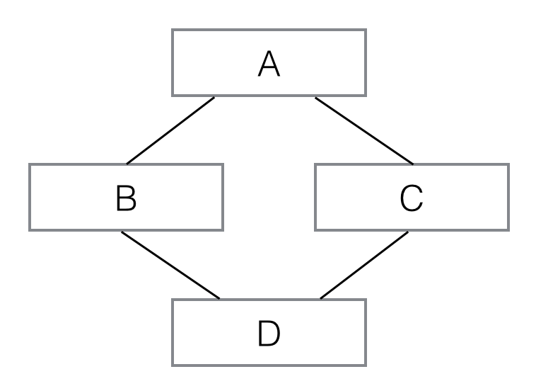

# PYTHON

解释型语言，运行速度慢，开发速度快

- [基本数据类型](#基本数据类型)
    - [Number](#Number)
        - [int](#int)
        - [float](#float)
        - [bool](#bool)
        - [complex](#complex)
    - [序列](#序列)
        - [str](#str)
        - [list](#列表list)
        - [tuple](#元组tuple)
        - [切片操作](#切片)
        - [zip](#zip)
        - [enumerate](#enumerate)
    - [无序](#无序)
        - [set](#集合set)
        - [dict](#字典dict)
- [控制流程语句](#控制流程语句)
    - [if-else](#if-else)
    - [for](#for)
    - [while](#while)
- [包和模块](#包和模块)
- [函数](#函数)
    - [定义](#定义)
    - [返回值](#返回值)
    - [参数](#参数)
    - [高阶函数](#高阶函数)
    - [匿名函数](#匿名函数)
    - [装饰器](#装饰器)
- [类](#类)
    - [变量](#变量)
    - [方法](#方法)
    - [继承](#类的继承)
    - [获取实例信息](#获取实例信息)
    - [定制类](#定制类)
- [正则表达式](#正则表达式)
    - [概括字符集](#概括字符集)

## 基本数据类型

### Number

#### int

- 使用int类型做除法运算(/)时会得到float类型，使用//会得到int类型的结果。

- bin() | 0b: 以二进制格式输出

- oct() | 0o: 以八进制格式输出

- hex() | 0x: 以十六进制格式输出

#### float
#### bool

- True: 也可以使用非0数字、非空字符串、非空数组表示

- Flase: 0、空字符串、空数组、None

#### complex（复数）

- - -
### 序列

    可以通过下标访问元素、切片操作、使用+、*操作符

#### str

- 可以使用单引号('')或者双引号("")表示字符串；使用三引号('''或""")或者\可以定义多行字符串

- 在字符串前面使用r或R表示字符串原样输出，不会进行转义

    ```
    print '\"To be, or not to be\": that is the question.\nWhether it\'s nobler in the mind to suffer.'

    print r'''"To be, or not to be": that is the question.
    Whether it's nobler in the mind to suffer.'''

    输出: 
    "To be, or not to be": that is the question. 
    Whether it's nobler in the mind to suffer.
    ```

- str * n: 输出n次字符串

    ` >>> 'hello'*2  => 'hellohello'`

- str[n]: 获取指定下标的字符

- str[-n]: 从后往前数第n个字符
    
- str[start:end]: 截取字符串。start表示开始位置，end表示结束位置（包头不包尾）。如果end为负数表示从后往前的第n个字符为结束位置（也不包括第n个字符）。如果end为空，表示直到字符串末尾。

- 显示中文使用字母u

    ` >>> print u'中文 日文 韩文' => 中文 日文 韩文 `

- 如果中文字符报错，需要在py文件第一行添加注释

    ` # -*- coding:utf-8 -*- ` 
- - -

#### 列表（list）

    使用[]定义，通过索引获取元素。如果使用开始位置和结束位置获取元素，返回的类型还是列表。

    正序访问下标从0开始。倒序访问从-1开始，表示倒数第一。

- append()
    
    追加新元素到列表的末尾

    ```
    L = ['Adam','Lisa','Bart']
    L.append('Paul')
    print L => ['Adam','Lisa','Bart','Paul']
    ```

- insert()

    插入新元素。参数1表示插入的位置；参数2表示插入的元素。

    - 如果在前面的位置插入，原来的元素会依次向后移动；
    - 如果指定的位置查过数组范围，则在数组末尾添加；
    - 如果指定的位置是负数，表示从后向前的第几位中插入，如果负数超过了数组的范围，则会在第一个位置插入。

    ``` 
    L = ['Adam','Lisa','Bart']
    L.insert(0,'Paul')
    print L => ['Paul','Adam','Lisa','Bart']
    ```
    ```
    L = [1,2,3]
    L.insert(-1,4)
    print L => [1,2,4,3]
    ```

- pop()

    删除数组中最后一个元素，并返回该元素。

    - 如果指定参数，表示删除该索引位置的元素；
    - 如果参数为负数，表示从后往前数删除第几个元素
        
        pop()不同于insert()，pop()指定的位置参数不能越界

    ```
    L = [1,2,3]
    del_ele = L.pop()
    print del_ele => 3
    print L => [1,2]
    ```
    ```
    L = [1,2,3]
    del_ele = L.pop(1)
    print del_ele => 2
    print L => [1,3]
    ```

- range()

    生成列表

    ```
    L = range(1,6)
    print L => [1,2,3,4,5]

    L = range(6)
    print L => [0,1,2,3,4,5]
    ```
    ```
    L = [x * x for x in range(1,6)]
    print L => [1,4,9,16,25] = [1*1,2*2,3*3,4*4,5*5]
    ```
    ```
    L = [x * (x+1) for x in range(1,100,2)]
    [1*2,3*4,5*6,...,99*100]

    L = [x * (x+1) for x in range(1,100,3)]
    [1*2,4*5,7*8,...]
    ```
    条件判断
    ```
    L = [x * x for x in range(1,11) if x % 2 == 0]
    print L => [4,16,36,64,100] = [2*2,4*4,6*6,8*8,10*10]
    ```
    多层循环
    ```
    L = [m + n for m in 'ABC' for n in '123']
    print L => ['A1','A2','A3','B1','B2','B3','C1','C2','C3']
    
    L = []
    for m in 'ABC':
        for n in '123':
            L.append(m + n)
    ```
    利用 3 层for循环的列表生成式，找出对称的 3 位数。例如，121 就是对称数，因为从右到左倒过来还是 121。
    ```
    L = [100 * i + 10 * j + k for i in range(1,10) for j in range(10) for k in range(10) if i == k]
    print L => [101,111,121,131,...,989,999]
    ```

- - -
#### 元组（tuple）

    使用()定义
- 如果元组中只有一个元素，返回该元素本身的类型；如果表示只有一个元素的元组，使用(e,)

    ``` 
    t = ()    
    print t => () 
    ```
    ``` 
    t = (1)    
    print t => 1 
    ```
    ``` 
    t = (1,)    
    print t => (1,) 
    ```

- 元组是不可变的，指的是本身的指向不能变。如果元组中的元素包含list，那么list中的元素是可以修改的
    ``` 
    t = (1,2,['x','y'])   
    L = t[2]
    L[0] = 'a'
    L[1] = 'b' 
    print t => (1,2,['a','b']) 
    ```
- - -
#### 切片

L = [start_index : end_index : step]

```
L = ['Adam','Lisa','Bart','Paul'] 

L[0:3] = L[:3] => ['Adam','Lisa','Bart']

L[1:3] => ['Adam','Lisa','Bart']

L[:] => ['Adam','Lisa','Bart','Paul']

L[::2] => ['Adam','Bart']

L[-2:] => ['Bart','Paul']

L[:-2] => ['Adam','Lisa']

L[-3:-1] => ['Lisa','Bart']

L[-4,-1,2] => ['Adam','Bart']
```
#### zip()

把两个序列合并成一个由元组组成的list

```
L = zip([10,20,30],['A','B','C'])
print L => [(10,'A'),(20,'B'),(30,'C')]
```
    
#### enumerate()

取索引函数，可以使用zip() + range()实现类似效果

```
L = ['Adam','Lisa','Bart'] 
for index,name in enumerate(L):
    print index, '-', name
0 - Adam
1 - Lisa
2 - Bart
```
- - -

### 无序

#### 集合（set）

    无序不可重复，使用set()表示空集

- 创建集合

    ```
    s = set(['a','b','c'])
    print s => set(['a','b','c'])
    ```
    如果list包含重复元素，set会自动去掉重复元素
    ```
    s = set(['a','b','c','c'])
    print s => set['a','b','c']
    print len(s) => 3
    ```

- 集合运算

    -: 差集（保留运算符左边集合中不同与右边集合的元素）

    ```
    s1 = set([1,2,3])
    s2 = set([3,4,5])
    s1 - s2 = set([1,2])
    ```

    &: 交集（两个集合中相同的元素）

    ```
    s1 = set([1,2,3])
    s2 = set([3,4,5])
    s1 & s2 = set([3])
    ```
    |: 并集（把集合中不重复的元素组成一个集合）
    ```
    s1 = set([1,2,3])
    s2 = set([3,4,5])
    s1 | s2 = set([1,2,3,4,5])
    ```
- add()

    添加元素。如果添加的元素已经存在，不会报错

- remove()

    删除元素。如果删除的元素不存在，会报错。

- - -

#### 字典（dict）

    {}表示空字典。key值必须是不可变类型。

- len()

    计算集合的大小

- get(key)

    判断key对应的value，如果key不存在返回None。

- values()

    把一个dict转换成由其中的value组成的list

- itervalues()

    在迭代过程中依次从dict中取出value

- items()

    把dict转成包含tuple的list

    ```
    d = {'Adam':95,'Lisa':85,'Bart':59}
    print d.items() => [('Lisa',85),('Adam',95),('Bart',59)]
    ```

- iteritems()

    在迭代过程中不断给出tuple，不占用额外内存

- - -
## 控制流程语句

### if-else

```
age = 20
if age >= 18:
    print 'adult'
elif age >= 13:
    print 'teenager'
else
    print 'kid'
```
### for
```
L = ['Adam','Bart','Lisa']
for name in L:
    print name
```
### while
```
while x < 100:
    print x
    x = x+1
```
- - -
## 包和模块

### 包

- 包中必须包含文件__init__.py，该文件的模块名就是包名，导入包时模块会自动执行

### 模块

- 使用import关键字导入模块
- 使用as关键字为模块起别名
- 使用from import导入指定的模块、变量或函数
    ```
    from math import pow,sin,log
    ```
- - -
## 函数
### 定义
- 使用def关键字定义，函数名推荐小写字母+下划线
    ```
    def my_abs(x):
        if x>=0:
            return x
        else:
            return -x
    ```
### 返回值
- 函数默认返回值是None。return None = return
- 如果返回值有多个，则返回一个tuple

    ```
    import math
    def move(x, y, step, angle):
        nx = x + step * math.cos(angle)
        ny = x + step * math.sin(angle)
        return nx, ny

    x, y = move(100,100,60,math.pi / 6)
    print x, y => 151.961524227    70.0
    
    r = move(100,100,60,math.pi / 6)
    print r => (151.961524227, 70.0)
    
    ```
### 参数
- 关键字参数

    可以不按形参的顺序传递，按照形参名=值的格式传递。

    关键字参数必须在实际必传参数的后面

- 默认参数

    可以为形参指定默认值

    默认参数必须在必传参数的后面

    ```
    def greet(content='world'):
        print 'hello,' + content
    
    greet() => hello,world
    greet('python') => hello,python
    ```
- 可变参数

    可以传0个或多个参数

    ```
    def fn(*args):
        print args

    fn() => ()
    fn('a','b') => ('a','b')
    ```
### 高阶函数
- map()
- reduce
- filter

### 匿名函数

- 使用lambda关键字定义匿名函数
- 匿名函数的函数体只能有一个表达式
- 不需要return语句返回
- 冒号前面表示参数，冒号后面表示函数表达体

    ```
    L = map(lambda x: x*x, [1,2,3])
    print L => [1,4,9]
    ```
    
    ```
    L = sorted([1,3,9,5,0],lambda x,y : -cmp(x,y))
    print L => [9,5,3,1,0]
    # cmp()比较函数
    ```
    ```
    my_abs = lambda x : -x if x < 0 else x
    print my_abs(-1) => 1
    print my_abs(1) => 1
    # 三元运算 [on_true] if [expression] else [on_false]
    ```
- - -
### 装饰器

    在运行时动态增加函数功能并且不修改函数本身

自定义装饰器函数
```
def fn(x):  #自定义函数
    return x

def decorator(f):   #定义装饰器函数
    def wrapper(x):
        ...     #要扩展的功能，例如打印日志
        return f(x)     #调用原函数并返回结果
    return wrapper

#调用方式一
f = decorator(fn)
f(x)

#调用方式二 - 覆盖原函数。python内置的装饰器注解使用该方式
fn = decorator(fn)
fn(x)
#等价于
@decorator()

```
带参数的装饰器函数
```
import time

def performance(unit):      #最外层函数，传递自定义的单位
    def decorator(f):       #装饰器函数
        def wrapper(*args,**kw):    
            start_time = time.time()
            result = f(*args,**kw)  #调用原函数
            end_time = time.time()
            #打印函数执行时间和函数名
            print 'call %s() time %f%s' % (f.__name__,(end_time - start_time),unit)
            return result   #返回原函数结果
        return wrapper
    return decorator

@performance('ms')  #调用最外层函数，传递unit值
def factorial(n):
    return reduce(lambda x,y : x*y, range(1,n+1))

factorial(10)
#等价于
f = performance('ms')
factorial = f(factorial)
factorial(10)
```
#### functools.wraps

    复制原函数的必要属性。因为使用装饰器会改变原函数的__name__和__doc__等属性

```
import time, functools

def performance(unit):
    def perf_decorator(f):
        @functools.wraps(f)
        def wrapper(*args,**kw):
            t1 = time.time()
            result = f(*args,**kw)
            t2 = time.time()
            print 'call %s() time %f%s' % (f.__name__,t2-t1,unit)
            return result
        return wrapper
    return perf_decorator

@performance('ms')
def factorial(n):
    return reduce(lambda x,y: x*y, range(1, n+1))

print factorial.__name__ => factorial
```
#### functools.partial

    偏函数

```
import functools

# 修改sorted函数的行为，生成新函数
# 方式1
sorted_ignore_case = functools.partial(sorted,key=str.lower)

# 方式2
sorted_ignore_case = functools.partial(sorted,cmp=lambda x,y: cmp(x.lower(),y.lower()))

print sorted_ignore_case(['bob', 'about', 'Zoo', 'Credit'])

=> ['about', 'bob', 'Credit', 'Zoo']
```
- - -
## 类

    使用class关键字定义

### 变量

变量前面使用__表示为私有属性，外部访问不到

- 类变量

    定义在类中

- 实例变量

    定义在构造函数中

### 方法

- 构造方法

    使用__init__(self)定义

    第一个参数必须是self（也可以是别的名字，习惯使用self）

    在构造方法中访问实例变量必须使用self.xxx的形式，只使用变量名访问的是形参中的变量

    访问类变量使用类名.变量名或者self.\_\_class\_\_.变量名

- 实例方法

    定义在类中的方法，第一个参数必须是self，表示调用该方法的实例对象

- 类方法

    使用@classmethod注解

    类和实例都可以调用类方法

    类方法可以直接访问类变量

    方法的第一个参数必须要指定，一般使用cls

- 静态方法

    使用@staticmethod注解

    不需要指定第一个参数

- - -

### 类的继承

#### 单继承
```
class Person(object):
    def __init__(self,name,gender):
        self.name = name
        self.gender = gender
    
class Student(Person):
    def __init__(self,name,gender,score):
        # 调用父类构造方法
        super(Student,self).__init__(name,gender)
        self.score = score
```
#### 多重继承
```
class A(object):
    def __init__(self, a):
        print 'init A...'
        self.a = a

class B(A):
    def __init__(self, a):
        super(B, self).__init__(a)
        print 'init B...'

class C(A):
    def __init__(self, a):
        super(C, self).__init__(a)
        print 'init C...'

class D(B, C):
    def __init__(self, a):
        super(D, self).__init__(a)
        print 'init D...'

>>> d = D('d')
init A...
init C...
init B...
init D...
```


- - -
### 获取实例信息

#### isinstance(instance,Class)

判断实例是否属于该类

#### type()

返回Type对象，保存着变量的类型

```
>>> type(123)
<type 'int'>

>>> s = Student()
>>> type(s)
<class '__main__.Student'>
```

#### dir()

获取变量的所有属性

```
>>> dir(123)   # 整数也有很多属性...
['__abs__', '__add__', '__and__', '__class__', '__cmp__', ...]

>>> s = Student()
>>> dir(s)
['__class__', '__delattr__', '__dict__', '__doc__', '__format__', '__getattribute__', '__hash__', '__init__', '__module__', '__new__', '__reduce__', '__reduce_ex__', '__repr__', '__setattr__', '__sizeof__', '__str__', '__subclasshook__', '__weakref__', 'gender', 'name', 'score', 'whoAmI']
```

#### getattr()

```
>>> s = Student('Bob')
>>> getattr(s,'name')   
# 获取name属性，如果属性不存在会报错
'Bob'

>>> getattr(s, 'age', 20)  
# 获取age属性，如果属性不存在，就返回默认值20：
20
```

#### setattr()
```
>>> setattr(s, 'name', 'Adam')  # 设置新的name属性
```
- - -
### 定制类

#### \_\_str\_\_

类似于toString()，该方法显示给用户。

#### \_\_repr\_\_

类似与toString()，该方法显示给开发人员。

#### \_\_cmp\_\_

比较函数。定义实例排序的规则

#### \_\_len\_\_

#### \_\_int\_\_

#### \_\_float\_\_

#### @property

```
class Student(object):
    def __init__(self, name, score):
        self.name = name
        self.__score = score

    @property   # 相当于getter()
    def score(self):
        return self.__score

    @score.setter   # 相当于setter()
    def score(self, score):
        if score < 0 or score > 100:
            raise ValueError('invalid score')
        self.__score = score

>>> s = Student('Bob', 59)
>>> s.score = 60
>>> print s.score
60
>>> s.score = 1000
Traceback (most recent call last):
  ...
ValueError: invalid score
```

#### \_\_slots\_\_

限制当前类所拥有的属性

#### \_\_call\_\_

实现该方法可以将一个类实例变成一个可调用对象

```
class Fib(object):
    def __call__(self,num):
        a, b, L = 0, 1, []
        for m in range(num):
            L.append(a)
            a, b = b, a + b
        return L

f = Fib()
print f(10)
```
- - -
## 正则表达式

### 概括字符集

- \d = [0-9]

    匹配数字字符

- \D = [^0-9]

    匹配非数字字符

- \w = [A-Za-z0-9_]

    匹配单词字符

- \W = [^A-Za-z0-9_]

    匹配非单词字符

